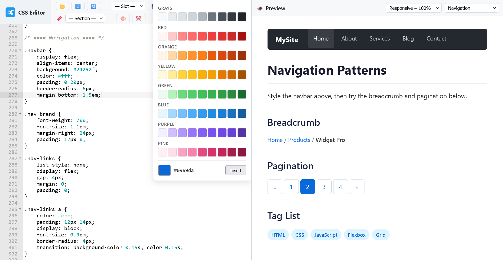

# CSS Editor

[](LICENSE)
[](https://arakel2.github.io/css-editor/)

<p align="center">
  
</p>
<p align="center">
  A lightweight, standalone CSS editor for quickly testing and tweaking
  stylesheets — right in your browser.
</p>
<p align="center">
  <a href="https://arakel2.github.io/css-editor/">👉 Live Demo</a> ·
  <a href="https://github.com/arakel2/css-editor/releases">⬇️ Download</a>
</p>

---

## ✨ Features

| Feature | Description |
|---|---|
| ⚡ Live editing | CSS changes apply to the preview instantly — no reload needed |
| 🔌 100 % offline | No server, no bundler, no Node.js. Just open `index.html` in your browser. |
| 💾 Version control | Save, rename, and delete named CSS versions in `localStorage` |
| 📂 File I/O | Load `.css` files from disk · Download your CSS anytime |
| 🔖 Section jumps | Navigate large stylesheets via `/* === Section Name === */` comments |
| 👁️ HTML samples | Seven built-in templates (typography, tables, forms, cards, navigation, code, lists) |
| 🔄 Reset button | Restore the default stylesheet with one click |
| 📱 Isolated preview | Preview runs in an `<iframe>` — your CSS never leaks into the editor UI |
| 💾 Persistent storage | Your work is saved automatically to `localStorage` |
| ⚙️ Zero dependencies | A single HTML file plus a few scripts. Easy to understand, easy to extend. |
| 🎨 Easy customization | Add your own templates, color palettes, and snippets |


## Screenshot



## 🚀 Quick Start

1. **Download** the [latest release](https://github.com/arakel2/css-editor/releases)  or clone the repo:
   
   ```bash
   git clone https://github.com/arakel2/css-editor.git
   ```
2. **Use it** — Open `index.html` in your browser and start editing.

> **Requirements:** A modern browser (Firefox, Chrome, Edge, Safari).  
> Works offline – no server required.


## 📂 File Structure

```
css-editor/
├── index.html          Main application
├── style.js            Default CSS loaded on first run
├── assets/
│   ├── favicon-32x32.png
│   ├── favicon-16x16.png
│   └── icon-180x180.png
├── palettes/
│   └── default.js      Default color palettes
├── snippets/
│   └── default.js      Default snippets
├── samples/
│   ├── sample1.js      Standard Elements
│   ├── sample2.js      Lists
│   ├── sample3.js      Tables
│   ├── sample4.js      Forms
│   ├── sample5.js      Card Layout
│   ├── sample6.js      Navigation
│   └── sample7.js      Code & Pre
└── ace/
    ├── ace.js                          ACE editor core
    ├── mode-css.js                     CSS syntax highlighting
    ├── theme-github_light_default.js   GitHub theme
    ├── ext-language_tools.js           Autocompletion
    ├── ext-searchbox.js                Searchbox
    ├── LICENSE                         BSD License (Ajax.org B.V.)
    └── ace-color-preview.js            Inline color preview
```


## ⚙️ Customization

### Add Your Own Samples 📋

Create a new file in the `samples/` folder:

```js
// samples/sample8.js
window.CSS_SAMPLES = window.CSS_SAMPLES || [];
window.CSS_SAMPLES.push({
    name: 'My Custom Sample',
    html: `
        <h1>Hello World</h1>
        <p>Your HTML goes here.</p>
    `
});
```

Then add the script tag in `index.html` (before the app script):

```html
<script src="samples/sample8.js"></script>
```

### Use Your Own Default CSS 💻

Edit `style.js` to change the stylesheet that is loaded on first run or when clicking the 🔄 Reset button.   
The CSS is stored as a string in `window.cssContent`.

### Add Your Own Color Palettes 🎨

Create a new file in the `palettes/` folder:

```js
// palettes/brand-colors.js
window.CSS_PALETTES = window.CSS_PALETTES || [];
window.CSS_PALETTES.push({
    name: 'Brand Colors',
    colors: ['#ff6900', '#fcb900', '#00d084', '#0693e3', '#9b51e0']
});
```

Then add the script tag in `index.html`:
```html
<script src="palettes/brand-colors.js"></script>
```

Each palette needs a `name` (shown as group label) and an array of `colors` (any valid CSS color string, e.g. hex, rgb, hsl).

### Add Your Own Snippets 📝

Create a new file in the `snippets/` folder:

```js
// snippets/my-snippets.js
window.CSS_SNIPPETS = window.CSS_SNIPPETS || [];
window.CSS_SNIPPETS.push({
    name: 'My Snippets',
    items: [
        { label: '--brand',     value: 'var(--brand-color)' },
        { label: 'Flex center', value: 'display: flex;\n    align-items: center;' }
    ]
});
```

Then add the script tag in `index.html`:
```html
<script src="snippets/my-snippets.js"></script>
```

Each item needs a `label` (button text) and a `value` (text inserted at cursor position). Use `\n` for line breaks in multi-line snippets.


## 🔗 Live Demo

The editor is hosted via GitHub Pages:

👉 **https://arakel2.github.io/css-editor/**


## 📚 Third-Party Libraries

This project includes [ACE](https://ace.c9.io/) — a high-performance code editor for the web, developed by [Ajax.org B.V.](https://github.com/ajaxorg/ace)  
ACE is licensed under the **BSD License**. See [`ace/LICENSE`](ace/LICENSE) for details.


## License

This project is licensed under the [MIT License](LICENSE).  
&copy; 2026 by Andreas Keller (arakel2)
